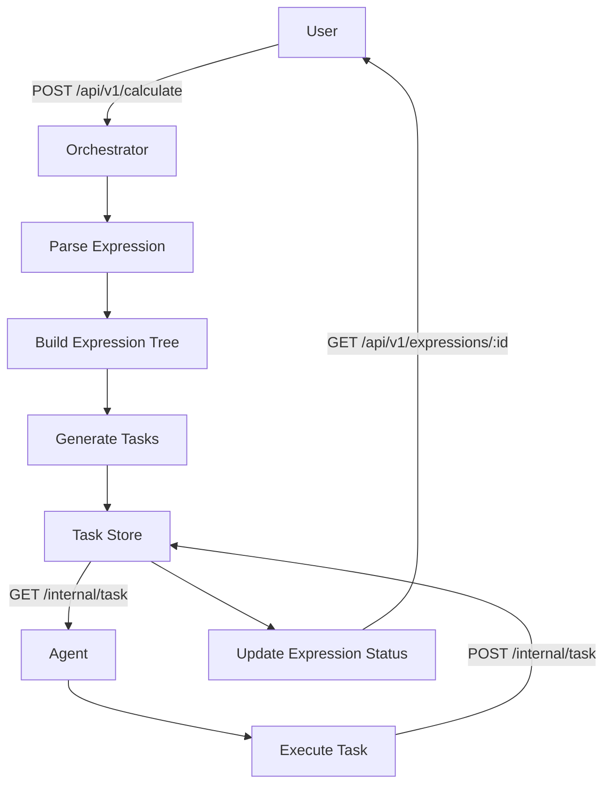

# Distributed Calculator

This project implements a distributed system for evaluating arithmetic expressions asynchronously.
It splits an input expression into independent tasks that can be processed concurrently.
The system is divided into two main components:

- Orchestrator: Accepts expressions via HTTP, parses them, decomposes them into tasks, and manages the execution order.
- Agent: Polls the orchestrator for tasks, performs the computations (with simulated delays), and reports the results back.


## How to run

Prerequisites:
- Go 1.23 or later
- Docker (optional)

Set environmental variables (or leave default ones defined in settings.go files):
- `ORCHESTRATOR_PORT` - Port of the orchestrator (default: `"8080"`)
- `TIME_ADDITION_MS` – Delay (in milliseconds) for addition (default: `1000`)
- `TIME_SUBTRACTION_MS` – Delay for subtraction (default: `1000`)
- `TIME_MULTIPLICATIONS_MS` – Delay for multiplication (default: `1000`)
- `TIME_DIVISIONS_MS` – Delay for division (default: `1000`)
- `COMPUTING_POWER` – Number of concurrent agent goroutines to run (default: `2`)

### Run as separate modules:
- Run orchestrator:
    - ```bash
      cd .\orchestrator\cmd
      ```
    - ```bash
      go run main.go
      ```
- Run agent:
    - ```bash
      cd .\agent\cmd
      ```
    - ```bash
      go run main.go
      ```

### Run both modules simultaneously:
**Run locally with:**
```bash
go run main.go
```

> [!TIP]
> You might want to create following go.work in root to run it locally
> ```
> go 1.23
> use (
>   agent
>   calculator
>   orchestrator
>   .
> )
>```

**Or run in Docker container:**
```bash
docker build --tag "calculator" .
```
```bash
docker run "calculator"
```

## API endpoints:

1. #### POST /api/v1/calculate
    Description:
    Submits an arithmetic expression for evaluation. The expression is parsed, converted into tasks, and stored for asynchronous processing.

    **Successful Request (201 Created):**
    - Request:
      ```bash
      curl -X POST http://localhost:8080/api/v1/calculate \
           -H "Content-Type: application/json" \
           -d '{"expression": "2+2*2"}'
      ```
    - Response:
      ```json
      {
          "id": "unique-expression-id"
      }       
      ```
    - When occurs:  
      The expression is valid and tasks are generated successfully.

    **Invalid Data (422 Unprocessable Entity):**
    - Request:
      ```bash
      curl -X POST http://localhost:8080/api/v1/calculate \
           -H "Content-Type: application/json" \
           -d '{"expression": "2+"}'
      ```
    - Response:  
      Status 422 (Unprocessable Entity) with message "error processing expression"
    - When occurs:  
      When given expression is not valid (e.g. missing operand)

    **Internal Error (500 Internal Server Error):**
    - When occurs:  
      An unexpected error occurs during tokenization, parsing, or task generation

2. #### GET /api/v1/expressions
   Description:  
   Retrieves a list of all expressions with their statuses and results.

   **Successful Request (200 OK):**
    - Request:
      ```bash
      curl http://localhost:8080/api/v1/expressions
      ```
    - Response:
      ```json
      {
        "expressions": [
          {
            "id": "a1d39298-d20d-4fa6-8d73-fe3cde5738e7",
            "expression": "2+2*2",
            "status": "done",
            "result": 6
          },
          {
            "id": "a1d39298-d20d-4fa6-8d73-fe3cde5738e7",
            "expression": "2+2*2",
            "status": "pending"
          }
        ]
      }
      ```
    This endpoint returns 200 unless a severe internal error occurs (500).

3. #### GET /api/v1/expressions/:id
   Description:  
   Retrieves a specific expression by its ID.

   **Successful Request (200 OK):**
    - Request:
      ```bash
      curl http://localhost:8080/api/v1/expressions/uuid
      ```
    - Response:
      ```json
      {
        "expression":
          {
            "id":"eec27e72-3654-4205-bc56-4bb7f97ac7cc",
            "expression":"(2+2)*(3+3)",
            "status":"done",
            "result":24
          }
      }
      ```
    - When occurs:  
      Existing id is given

   **Expression Not Found (404 Not Found):**
    - Request:
      ```bash
      curl http://localhost:8080/api/v1/expressions/non-existing-uuid
      ```
    - Response:
      Code 404 with message "not found"
    - When occurs:  
      Non existing id is given

4. #### GET /internal/task
    Description:  
    Returns a task for the agent to compute. Only tasks whose dependencies are satisfied will be served.

    **Successful Request (200 OK):**
    - Request:
     ```bash
     curl http://localhost:8080/internal/task
     ```
    - Response:
     ```json
     {
       "task": {
          "id": "some-id",
          "arg1": 2,
          "arg2": 2,
          "operation": "+",
          "operation_time": 1000
       }
     }
     ```
    - When occurs:  
      There is pending task available

   **No Task Available (404 Not Found):**
    - Request:
      ```bash
      curl http://localhost:8080/internal/task
      ```
    - Response:
      Coded 404 with message "no task"
    - When occurs:  
      There are no pending tasks available
    
5. #### POST /internal/task
    Description:  
    Submits the result of a computed task back to the orchestrator.

   **Successful Request (200 OK):**
    - Request:
      ```bash
      curl -X POST http://localhost:8080/internal/task \
           -H "Content-Type: application/json" \
           -d '{"id": "task1", "result": 4}'

      ```
    - Response:
      ```json
      {
          "status": "result recorded"
      }
      ```
    - When occurs:  
      The task exists, is in the "running" state, and the result is successfully recorded.

   **Task Not Found (404 Not Found):**
    - Request:
      ```bash
      curl -X POST http://localhost:8080/internal/task \
           -H "Content-Type: application/json" \
           -d '{"id": "task1", "result": 4}'
      ```
    - Response:
      Code 404 with message "task not found"
    - When occurs:  
      The provided task ID does not match any task in the system.

   **Invalid Task State (422 Unprocessable Entity):**
    - Request:
      ```bash
      curl -X POST http://localhost:8080/internal/task \
           -H "Content-Type: application/json" \
           -d '{"id": "task1", "result": 4}'
      ```
    - Response:
      Code 422 with message "task not in running state"
    - When occurs:  
      The task exists but its current state does not allow for result submission (e.g., it’s already completed or not yet properly claimed).

## System Architecture


